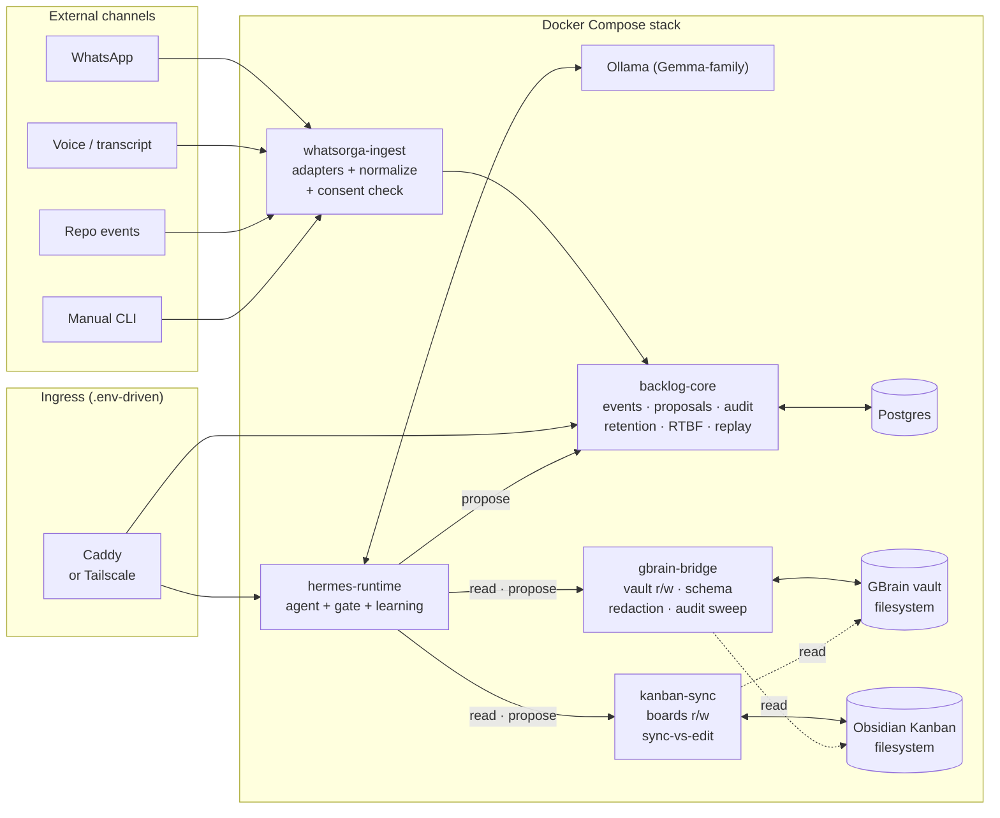

# Architecture

## Purpose

This document describes the system architecture for `project-agent-system`. It defines the components, their boundaries, and how they interact to satisfy the approved goals and requirements (`1-spec/CLAUDE.spec.md`). The design principle is **simplest design that makes every approved requirement satisfiable** — complexity is introduced only where a simpler alternative fails to satisfy a requirement or violates a constraint.

## Components

The system is composed of **five services** running together as a Docker Compose stack on a single VPS, plus an Ollama sidecar for local model inference and three storage layers.

### `whatsorga-ingest`

**Responsibility:** Adapter layer + normalization. Hosts one adapter per input channel (WhatsApp, voice transcript, repository event, manual CLI) and produces channel-agnostic `input_event`s that flow into `backlog-core`. Performs the consent check at the system boundary.

**Inputs:** raw payloads from each channel (per its adapter contract).

**Outputs:** `input_event` records committed via HTTP to `backlog-core`.

**Why distinct:** isolates platform-specific code (WhatsApp session attachment, voice transcription pipeline, repo webhook receivers) so channel concerns never leak into routing or extraction. Required by `REQ-F-input-event-normalization`.

**Constraints upheld:** `CON-consent-required` (consent check at the boundary), `CON-no-platform-bypass` (adapter contract constrained per [`DEC-platform-bypass-review-checklist`](../decisions/DEC-platform-bypass-review-checklist.md)).

### `hermes-runtime`

**Responsibility:** Hosts the agent (Ollama-backed Gemma-family model), the agent's skills (including project routing, artifact extraction, **duplicate detection** per `REQ-F-duplicate-detection`, brain-first lookup, and remote-inference model routing), the **confidence-gate middleware**, and the **learning-loop** skill. Has read access to `backlog-core` and the GBrain vault but **no write credentials** for any system of record.

Duplicate detection runs as a `hermes-runtime` skill (rather than at `whatsorga-ingest` or in `backlog-core`'s validation step) for two reasons: (i) it benefits from the GBrain context the agent already reads for routing — semantic similarity scoring against recent project episodes is a natural extension of brain-first lookup; (ii) operator splits of false-positive duplicates feed directly into the `learning-loop` as `duplicate_correction` learning events, which the agent already consumes within-session.

**Inputs:** input-event notifications from `backlog-core`; operator inputs via CLI.

**Outputs:** `proposal` events submitted to `backlog-core`; HTTP calls to `gbrain-bridge` and `kanban-sync` (proposals only).

**Why distinct:** different security posture from persistence services per `CON-no-direct-agent-writes`. The gate ([`DEC-confidence-gate-as-middleware`](../decisions/DEC-confidence-gate-as-middleware.md)) is enforced inside this service.

**Constraints upheld:** `CON-confidence-gated-autonomy`, `CON-no-direct-agent-writes`, `CON-human-correction-priority`, `CON-local-first-inference`.

### `backlog-core`

**Responsibility:** The event-sourced technical truth layer. Hosts:

- The append-only event log in Postgres (proposals, dispositions, mutations, audit, learnings, retention-sweep events, RTBF cascade events) — see `data-model.md`.
- The proposal pipeline (propose → validate → apply, with `proposal_id` chaining).
- Per-source consent records (current state + append-only history per `REQ-COMP-consent-record`).
- The hash-chained audit log (`REQ-SEC-audit-log`).
- The retention sweep service (`REQ-F-retention-sweep`).
- The RTBF cascade engine (`REQ-COMP-rtbf`).
- The data-export tool (`REQ-COMP-data-export`).
- The state-reconstruction service (`REQ-F-state-reconstruction` and replay correctness per `REQ-REL-event-replay-correctness`).
- The daily reconciliation job (`REQ-REL-audit-reconciliation`).

**Inputs:** HTTP from `whatsorga-ingest` (input events), `hermes-runtime` (proposals), CLI (operator commands).

**Outputs:** events committed; mutation outcomes returned synchronously; cascade requests fanned out to `gbrain-bridge` and `kanban-sync` for RTBF and proposal-applied side effects.

**Why distinct:** concentrates the "single source of truth" responsibility. Simplifies replay, audit, and rollback semantics by giving them one home.

### `gbrain-bridge`

**Responsibility:** The only component that mutates the GBrain vault filesystem. Enforces:

- Schema validation per `REQ-F-gbrain-schema`.
- Bidirectional link integrity per `REQ-F-bidirectional-links` (atomic forward + back link writes).
- Redaction-precondition check per `REQ-SEC-redaction-precondition`.
- Weekly vault audit sweep per `REQ-MNT-vault-audit-sweep`.
- Watch script for the [Obsidian-as-review-UI](../decisions/DEC-obsidian-as-review-ui.md) flow.

**Inputs:** HTTP write proposals from `hermes-runtime`; cascade requests from `backlog-core` (RTBF deletes propagate through here); Obsidian command-palette dispositions arriving via the watch script.

**Outputs:** vault file mutations; audit events to `backlog-core`; disposition HTTP calls to `backlog-core` translated from Obsidian command-palette events.

**Why distinct:** schema, redaction, and link rules differ from those of `kanban-sync`; concentrating GBrain mutations in one place lets `hermes-runtime` and other components remain agnostic to vault internals.

### `kanban-sync`

**Responsibility:** Obsidian Kanban markdown file I/O. Maintains the sync-vs-edit boundary (sync-owned vs. user-owned card frontmatter fields per `REQ-USA-kanban-obsidian-fidelity`); detects manual column moves and unattributed edits and emits them as events.

**Inputs:** HTTP write proposals from `hermes-runtime`; periodic file-system polling for human edits.

**Outputs:** Kanban file mutations; `kanban.user_edit` and `unattributed_edit` events to `backlog-core`.

**Why distinct:** different schema and edit-detection logic from `gbrain-bridge`; runs against a separate filesystem subtree (`<vault>/Kanban/`).

## Stores

- **Postgres** (`backlog-core`'s store) — event log, consent records, audit log, retention-sweep state, reconciliation reports. See [`DEC-postgres-as-event-store`](../decisions/DEC-postgres-as-event-store.md).
- **GBrain vault** (filesystem volume; `gbrain-bridge`'s domain) — markdown pages with frontmatter per `REQ-F-gbrain-schema`. Subtree layout drafted in `data-model.md`.
- **Obsidian Kanban** (filesystem volume; `kanban-sync`'s domain — namespaced under `<vault>/Kanban/` to avoid collision with `gbrain-bridge`).
- **Ollama model storage** (sidecar volume) — the Gemma-family model and any locally-hosted alternates.

## Ingress

A single reverse-proxy service is deployed in front of `hermes-runtime` and the operator-facing endpoints of `backlog-core`. The choice is `.env`-driven per `REQ-MNT-env-driven-config`:

- **Caddy** (default) with a public hostname.
- **Tailscale** (optional) for private-network-only access.

The system runs end-to-end in either mode without code changes.

## Inter-service communication

Synchronous HTTP/REST between services — see [`DEC-direct-http-between-services`](../decisions/DEC-direct-http-between-services.md). No message bus at MVP.

## Confidence-gate placement

The gate is implemented as middleware **inside `hermes-runtime`**, not as a separate service. See [`DEC-confidence-gate-as-middleware`](../decisions/DEC-confidence-gate-as-middleware.md).

Defense-in-depth: persistence services (`backlog-core`, `gbrain-bridge`, `kanban-sync`) additionally enforce service-to-service auth and per-component declared purposes at their HTTP boundary. A bug in `hermes-runtime` that omitted gate invocation cannot bypass the persistence-side check. Auth tokens are scoped per service and rotated independently per `REQ-REL-secret-rotation`. Bypass attempts surface in [`REQ-REL-audit-reconciliation`](../1-spec/requirements/REQ-REL-audit-reconciliation.md)'s daily report.

## Operator surfaces

Two surfaces, neither requires a dedicated frontend service.

### Obsidian as the review UI

Per [`DEC-obsidian-as-review-ui`](../decisions/DEC-obsidian-as-review-ui.md). Review-queue items, agent-decision detail views, and reconciliation reports are written as GBrain pages with structured frontmatter under `09_Inbox/review-queue/`, `09_Inbox/proposals/`, and `05_Learnings/agent-behavior/reconciliation/`. Operators dispose of items by selecting an Obsidian command-palette command (e.g., `Vision: Accept proposal`, `Vision: Reject with reason`) wired to a watch script run by `gbrain-bridge`. The watch script reads the page's frontmatter, prompts for any required input, and posts the disposition to `backlog-core`'s proposal-pipeline endpoint.

This satisfies `REQ-F-review-queue`, `REQ-F-correction-actions`, and `REQ-F-decision-inspection` without adding a frontend service.

### CLI for high-stakes operator actions

Operations that benefit from explicit, transactional invocation rather than a vault-mediated flow:

- Source registration / consent updates / revocation (`REQ-F-source-registration`, `REQ-F-consent-revocation`)
- RTBF cascade (`REQ-COMP-rtbf`)
- Data-subject export (`REQ-COMP-data-export`)
- Backup / restore (`REQ-REL-backup-restore-fidelity`)
- Secret rotation (`REQ-REL-secret-rotation`)
- VPS install + smoke test (`REQ-PORT-vps-deploy`)

CLI commands invoke `backlog-core` HTTP endpoints. The CLI binary ships in `scripts/`; commands are documented in `4-deploy/runbooks/`.

## Constraint compliance

| Constraint | How the architecture satisfies it |
|---|---|
| `CON-consent-required` | Consent check at the `whatsorga-ingest` boundary; consent records owned by `backlog-core`; revocation halts ingest before next event |
| `CON-no-platform-bypass` | Adapter contract in `whatsorga-ingest` constrained to user-attached / official paths; reviewer checklist in [`DEC-platform-bypass-review-checklist`](../decisions/DEC-platform-bypass-review-checklist.md) |
| `CON-confidence-gated-autonomy` | Gate middleware in `hermes-runtime`; thresholds per project in `.env`; persistence-side auth as second layer |
| `CON-no-direct-agent-writes` | `hermes-runtime` runs without DB / vault credentials; persistence services accept proposals only |
| `CON-human-correction-priority` | Disposition events flow through `backlog-core`'s proposal pipeline; `learning-loop` skill in `hermes-runtime` reads from the same log |
| `CON-local-first-inference` | Ollama as default model runtime; remote inference profiles configured in `.env` (default empty) |
| `CON-vps-portable-deployment` | Docker Compose; all hostnames / ports / paths in `.env`; ingress profile via flag |
| `CON-gdpr-applies` | RTBF cascade engine + data-export + purpose-limitation enforced at persistence-service boundaries |
| `CON-tiered-retention` | Retention sweep in `backlog-core`; per-artifact `retention_class` in storage schemas |
| `CON-gbrain-no-raw-private-truth` | Redaction-precondition check enforced in `gbrain-bridge`; weekly vault audit sweep |

**No violations.** One namespacing concern resolved: `kanban-sync` and `gbrain-bridge` filesystem domains overlap (Kanban boards typically live inside the Obsidian vault). The Kanban subtree is `<vault>/Kanban/`; `gbrain-bridge` does not write under that prefix; the vault audit sweep skips it.

## Approved requirement coverage

All 10 currently-approved requirements are satisfiable by this architecture:

| Requirement | Component(s) responsible |
|---|---|
| `REQ-F-source-registration` | `backlog-core` (records) + CLI (operator surface) |
| `REQ-F-consent-revocation` | `backlog-core` (records, halt logic) + `whatsorga-ingest` (gate) |
| `REQ-F-retention-sweep` | `backlog-core` (sweep service, partition strategy per [`DEC-postgres-as-event-store`](../decisions/DEC-postgres-as-event-store.md)) |
| `REQ-COMP-consent-record` | `backlog-core` (append-only consent state, read-as-of capability) |
| `REQ-COMP-rtbf` | `backlog-core` (cascade engine) + `gbrain-bridge` + `kanban-sync` (cascade endpoints) + CLI |
| `REQ-COMP-data-export` | `backlog-core` (export tool) + CLI |
| `REQ-COMP-purpose-limitation` | All persistence services (purpose check at HTTP boundary, second layer of gate enforcement) |
| `REQ-SEC-audit-log` | `backlog-core` (hash-chained log + verification routine) |
| `REQ-SEC-redaction-precondition` | `gbrain-bridge` (write-time check); `kanban-sync` follows the same rule on its writes |
| `REQ-SEC-remote-inference-audit` | `hermes-runtime` (model-router + audit emission to `backlog-core`) |

The 24 still-`Draft` requirements are forward-compatible with this architecture. Notable: `REQ-USA-kanban-obsidian-fidelity` is satisfied by `kanban-sync`'s sync-vs-edit boundary; `REQ-F-state-reconstruction` and `REQ-REL-event-replay-correctness` are satisfied by `backlog-core`'s replay service.

## Performance characteristics

Two performance requirements (`Draft`, but explicitly traced into this architecture per gap-analysis M-4 closure 2026-04-29) define the runtime envelope at MVP hardware tier:

| Requirement | Component(s) | Mechanism in this architecture |
|---|---|---|
| [`REQ-PERF-ingest-latency`](../1-spec/requirements/REQ-PERF-ingest-latency.md) — p95 < 5 min autonomous, < 2 min review, 30-min stuck-alert tail | `whatsorga-ingest` (normalization + consent check) → `backlog-core` (input event persist + proposal pipeline) → `hermes-runtime` (routing/extraction skills + Ollama call) → `gbrain-bridge` / `kanban-sync` (terminal write) | Synchronous HTTP between services per [`DEC-direct-http-between-services`](../decisions/DEC-direct-http-between-services.md) avoids broker queue depth as a hidden bottleneck. Every hop emits a step-completion audit event (per [`DEC-hash-chain-over-payload-hash`](../decisions/DEC-hash-chain-over-payload-hash.md)), so p95 latency can be reconstructed from the event log without separate APM. The 30-min `processing.stuck` alert is `backlog-core`'s daily reconciliation job (per `REQ-REL-audit-reconciliation`) running on a tighter schedule against in-flight `proposal.proposed` events without a downstream `proposal.applied` or `proposal.rejected`. |
| [`REQ-PERF-routing-throughput`](../1-spec/requirements/REQ-PERF-routing-throughput.md) — ≥ 10 events/min sustained, ≥ 30 events/min burst on the 4 vCPU / 8 GB reference VPS | `hermes-runtime` (routing skill + brain-first-lookup + extraction) is the throughput-bound component because each event traverses an Ollama call. `backlog-core` (Postgres persistence) is not the bottleneck at MVP scale. | Default-local Gemma per [`CON-local-first-inference`](../1-spec/constraints/CON-local-first-inference.md) sets the baseline; routing skill is async-IO native (per [`DEC-backend-stack-python-fastapi`](../decisions/DEC-backend-stack-python-fastapi.md)) so concurrent in-flight events are bounded by Ollama's own concurrency limit, not by Python GIL contention. Burst tolerance comes from buffering at the FastAPI request layer plus Postgres event-log inserts being well below their own throughput ceiling. Remote-inference profile (`TASK-remote-inference-profile`, Phase 7) is the documented escape hatch if local-only burst tolerance proves insufficient. |

Both targets are validated by `TASK-perf-ingest-latency-tests` and `TASK-perf-routing-throughput-tests` (Phase 7), each linked to its requirement. Horizontal scaling is **not** an MVP capability per [`ASM-no-scalability-target`](../1-spec/assumptions/ASM-no-scalability-target.md) — vertical scaling on the reference VPS is the only documented adjustment path.

## Dependency on `ASM-derived-artifacts-gdpr-permissible`

Per [`DEC-gdpr-legal-review-deferred`](../decisions/DEC-gdpr-legal-review-deferred.md), this architecture must include a fallback note where it depends on `ASM-derived-artifacts-gdpr-permissible` being valid.

**Where the architecture depends on the assumption:**

- `gbrain-bridge` enforces `derived_keep` retention on derived artifacts (summaries, decisions, learnings) under the assumption that indefinite retention of derivatives under the original consent is GDPR-defensible.
- `backlog-core`'s consent-record schema treats derivative retention as covered by the original `consent_scope`'s purpose flags (`summarize`, `extract_artifacts`, `learning_signal`), without requiring a separate `derivative_retention_consent` flag.
- The RTBF cascade design assumes that subject erasure on derivatives is sufficient (vs. blanket time-bounded expiration of derivatives).

**Fallback if invalidated:**

- Add `derivative_retention_consent` as an explicit `consent_scope` flag (default `false`); migrate existing sources to time-bounded derivative retention (e.g., derivatives auto-expire 90 days after the source's `raw_30d` envelope is swept) until re-consented.
- `backlog-core`'s consent-record schema is append-only by design (per `REQ-COMP-consent-record`), so this migration is forward-compatible — historical states remain visible, new states are appended.
- `gbrain-bridge` gains a "derivative retention sweep" alongside the existing weekly vault audit, deleting expired derivatives on schedule.
- `kanban-sync` similarly removes cards whose source's derivatives have aged out.
- The RTBF cascade is unchanged; the migration is additive.

The migration is **localized to schema additions and a new sweep job** — no architectural component restructuring is required. The rework cost of an `Invalidated` outcome is therefore bounded to a fraction of the design.

## Decisions referenced by this architecture

- [`DEC-postgres-as-event-store`](../decisions/DEC-postgres-as-event-store.md)
- [`DEC-direct-http-between-services`](../decisions/DEC-direct-http-between-services.md)
- [`DEC-confidence-gate-as-middleware`](../decisions/DEC-confidence-gate-as-middleware.md)
- [`DEC-obsidian-as-review-ui`](../decisions/DEC-obsidian-as-review-ui.md)
- [`DEC-platform-bypass-review-checklist`](../decisions/DEC-platform-bypass-review-checklist.md)
- [`DEC-stakeholder-tiebreaker-consensus`](../decisions/DEC-stakeholder-tiebreaker-consensus.md)
- [`DEC-gdpr-legal-review-deferred`](../decisions/DEC-gdpr-legal-review-deferred.md)
